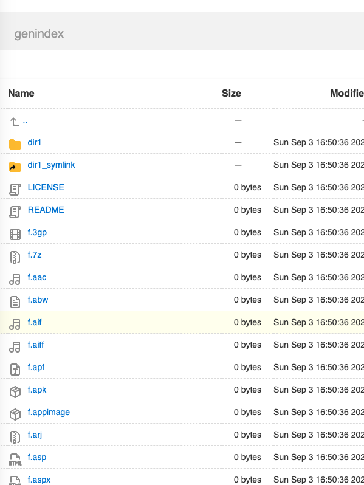

# index.html generator script
Python script to generate index.html files with custom options inspired by [caddy's file_server browse.html](https://github.com/caddyserver/caddy/blob/master/modules/caddyhttp/fileserver/browse.html).


## [Demo index.html](https://glowinthedark.github.io/index-html-generator/)



## Usage 

Run `./genindex.py -h` to see the usage:

```bash
usage: genindex.py [-h] [--filter FILTER] [--output-file filename]
                                  [--recursive] [--include-hidden]
                                  [--exclude-regex EXCLUDE_REGEX] [--verbose]
                                  [top_dir]

DESCRIPTION: Generate directory index files (recursive is OFF by default). Start
from current dir or from folder passed as first positional argument. Optionally
filter by file types with --filter "*.py".

positional arguments:
  top_dir               top folder from which to start generating indexes, use
                        current folder if not specified

options:
  -h, --help            show this help message and exit
  --filter FILTER, -f FILTER
                        only include files matching glob
  --output-file filename, -o filename
                        Custom output file, by default "index.html"
  --recursive, -r       recursively process nested dirs (FALSE by default)
  --include-hidden, -i  include dot hidden files (FALSE by default)
  --exclude-regex EXCLUDE_REGEX, -x EXCLUDE_REGEX
                        exclude files matching regular expression
  --verbose, -v         verbosely list every processed file
                        WARNING: can take longer time with complex file tree
                        structures on slow terminals
```
